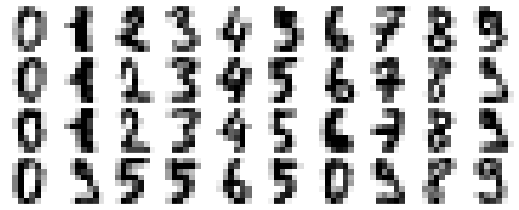
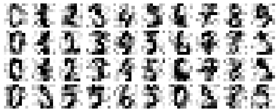
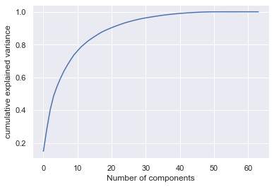
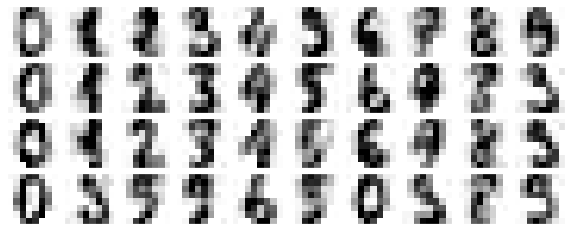

# Image-Denoising

### Background
Image noise is a random change in a pixel hue or saturation value of a pixel in an image. There can be multiple sources of image noise. Noise can get introduced inherently at different stage of image capture pipeline from light variation, camera optics, image sensor to image storage.

### The Problem
One of the fundamental challenge in the field of Image processing and Computer vision is Image denoising where the goal is to estimate the original image by suppressing noise from the contaminated region in an Image. This has numerous applications such as:
* digitisation and restoration of old images/documents.

* satellite imagery, etc

The aim of this project is to extract a clean image Ix from the noisy image Iy, with noisy component as In, which is explained by Iy=Ix+In.

### Metrics

#### PSNR(Peak Signal-to-Noise Ratio)
PSNR is most easily defined via the mean squared error (MSE). Given a noise-free m×n monochrome image I and its noisy approximation K, MSE is defined as:

{\displaystyle {\mathit {MSE}}={\frac {1}{m\,n}}\sum _{i=0}^{m-1}\sum _{j=0}^{n-1}[I(i,j)-K(i,j)]^{2}}{\mathit  {MSE}}={\frac  {1}{m\,n}}\sum _{{i=0}}^{{m-1}}\sum _{{j=0}}^{{n-1}}[I(i,j)-K(i,j)]^{2}
The PSNR (in dB) is defined as:

{\displaystyle {\begin{aligned}{\mathit {PSNR}}&=10\cdot \log _{10}\left({\frac {{\mathit {MAX}}_{I}^{2}}{\mathit {MSE}}}\right)\\&=20\cdot \log _{10}\left({\frac {{\mathit {MAX}}_{I}}{\sqrt {\mathit {MSE}}}}\right)\\&=20\cdot \log _{10}\left({{\mathit {MAX}}_{I}}\right)-10\cdot \log _{10}\left({\mathit {MSE}}\right)\end{aligned}}}{\begin{aligned}{\mathit  {PSNR}}&=10\cdot \log _{{10}}\left({\frac  {{\mathit  {MAX}}_{I}^{2}}{{\mathit  {MSE}}}}\right)\\&=20\cdot \log _{{10}}\left({\frac  {{\mathit  {MAX}}_{I}}{{\sqrt  {{\mathit  {MSE}}}}}}\right)\\&=20\cdot \log _{{10}}\left({{\mathit  {MAX}}_{I}}\right)-10\cdot \log _{{10}}\left({{{\mathit  {MSE}}}}\right)\end{aligned}}

#### SSIM

### Data 

### Approaches
#### Unsupervised
##### Vanilla PCA

Principal component analysis is a orthogonal transformation which seeks the direction of maximum variance in the data and commonly used in dimensionality reduction of the data. Data with maximum variance is contains most of the data needed to present the whole dataset. In image denoising one has to take care of the compromise between noisy data and preserving the high variance image data detail. We can start by looking into the plain PCA analysis to see how PCA inherently tries to reduce the noise in an image.

The basic intuition behind denoising the image is that any components with variance much larger than the effect of the noise should be relatively unaffected by the noise. So if you reconstruct the data using just the largest subset of principal components, you should be preferentially keeping the signal and throwing out the noise. This is the very basic idea behind how a PCA simply can reduce noise from the image. Though this is not an efficient approach(we will look at better approach through modified PCA in next section), we can look how a plain vanilla PCA can improve the PSNR(peak signal to noise ration) over an image.
We tried the plain vanilla PCA method in the mnist digit data set, an then in the RGB images.The approach is:
* Take the mnist dataset
* Add some random gaussian noise to the image
* Plot the variance vs Component curve to determine the component storing the highest variance.
* Apply inverse PCA to get the image back using the components derived in above step.
* Visualize the dataset again to see difference.

Before PCA transformation the digit dataset looks like this:

After this we add some random gaussian noise to it, to make pixels more blurr and add some noise to it.
After adding random gaussian noise the digit dataset looks like this:

Now we try to see the number of components which can capture most of the variance in the data. From the below
figure we can see that first 10 component can capture 80 percent of the variance in the data.

Next we try to plot the digit data for our noisy image using the first 10 component, and we can clearly see that 
it PCA preserves the signals and loses the noise from the data:

Let's run the same experiment in a RGB image to see if there an improvement in PSNR after PCA analysis.
The method remains the same:
* Take an Noisy RGB image
* Flattens the Image across 3 channels.
* Do PCA analysis to get the max number of components restoring maximum vaiance.
* Do inverse PCA transform to retrieve the same image using the component derived in the above step.
* Calculate the PSNR value for original,noisy image and original,denoised image and see if there is an improvement.

We ran the above process for the CBSD68-dataset provided by Berkeley. It contains both noisy and original image with different gaussian noise level.
Here below you can see the original image and then denoise image. 
[Image]

We plotted the psnr graphs for all the noisy datasets and from the figure below you can observe that when there is no
noise or very less gaussian noise than it is hard for the PCA to denoise the data, but when you started increasing the noise in the image(upto 50 gaussian noise), you can observe that psnr value improves for all images.

##### locally adaptive PCA
#### Supervised
##### Sateesh

   

##### Ramesh

