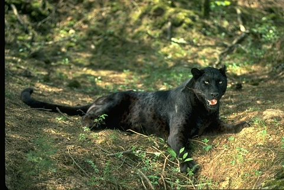
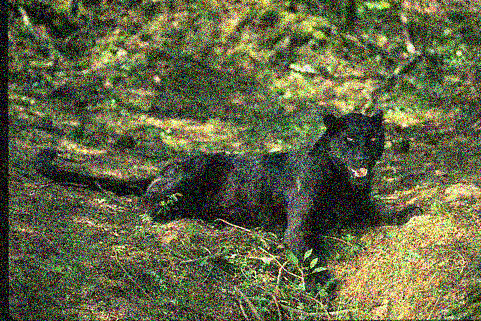
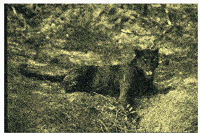
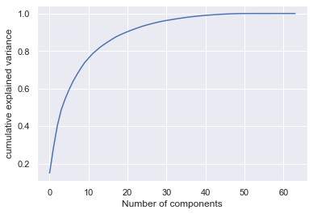
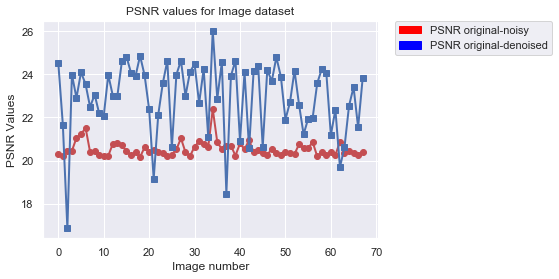
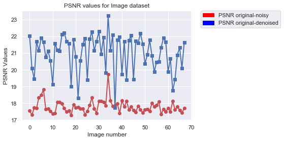

# Image-Denoising

### Background
Image noise is a random change in a pixel hue or saturation value of a pixel in an image. There can be multiple sources of image noise. Noise can get introduced inherently at a different stage of image capture pipeline from light variation, camera optics, image sensor to image storage.

### The Problem
One of the fundamental challenges in the field of Image processing and Computer vision is Image denoising, where the goal is to estimate the original image by suppressing noise from the contaminated region in an Image. Image Denoising has numerous applications, such as:
* digitization and restoration of old photos/documents.
* satellite imagery, etc

This project aims to extract a clean image Ix from the noisy image Iy, with noisy component as In, which is explained by Iy=Ix+In.

### Problem Scope
We are limiting the problem scope to tackle additive guassian white noise(AGWN) only and will demonstrate how supervised and unsupervised techniques could be used to denoise images with AGWN.

### Metrics

#### PSNR(Peak Signal-to-Noise Ratio)
PSNR is most easily defined via the mean squared error (MSE). Given a noise-free m×n monochrome image I and its noisy approximation K, MSE is defined as:

#### SSIM

The difference with respect to other techniques mentioned previously such as MSE or PSNR is that these approaches estimate absolute errors; on the other hand, SSIM is a perception-based model that considers image degradation as perceived change in structural information, while also incorporating important perceptual phenomena, including both luminance masking and contrast masking terms. Structural information is the idea that the pixels have strong inter-dependencies, especially when they are spatially close. These dependencies carry essential information about the structure of the objects in the visual scene. Luminance masking is a phenomenon whereby image distortions (in this context) tend to be less visible in bright regions, while contrast masking is a phenomenon whereby distortions become less visible where there is a significant activity or "texture" in the image.

### Data 

### Approaches
#### Supervised
##### Sateesh

## Approach 2

In this approach, we have used supervised learning to learn the clean image given a noisy image. The function approximator chosen is a neural network comprising of convolutional and residual blocks, as shown []. 

## Experiment 

Two datasets were used in this experiment [PASCAL] and [CBSD]. The PASCAl training data contains approximately () images. This dataset is split into training, valid and test datasets with (),() and () respectively. As shown in (), the architecture takes an Input image, and then it is passed through convolutional layers having 64 filters of 9x9 kernel size, 32 filters of 5x5 kernel size, and 1 filter of 5x5 filter size respectively. Relu activations are used in all the layers. Stride used is of size 1, so the output size is reduced by 8 pixels in all directions. To accommodate this, we can either pad the image or give a larger input size. We chose to go with the latter as chosen in []. So the input image size used is  33x33 and output size is 17x17. So as input images have varied dimensions in PASCAL dataset(or other datasets), during preprocessing, we have cropped the images. Note that crop can be at random part of the image. So, this acts as data augmentation technique as well. The 33x33 input image should have noise as well. The added noise is random from 10-50.

##### architecture

   

##### Training network: 

Pytorch is used to write the code, and network is trained in google colab [] using GPU's. 
Training is done batchwise using 128 batches of 33*33 noisy input images. MSE loss and Adam optimzer were used with learning rate of 0.001. Using the clean target image of 17x17, the MSE loss is calculated from the networks output image. Training is done for 100 epochs at this configuration. As loss got stagnated here we reduced learning rate to 0.0001 and trained another 50 epochs. After this, we added a residual block to the network and initialized its weights to random weights, with other layers weights unchanged. This network is trained for another 50 epochs with learning rate 0.01. We have stopped training at this point due to longer training periods (50 epochs approximately took 2 hours), even though it been shown in [], that adding more residual blocks will improve the PSNR scores further. At all stages of training, validation loss (as shown) is calculated and monitored as well to see if the network is generalizing to unseen data.

## loss curves.

  
 
## Results and Observations

The average PSNR scores and SSIM scores on the test set of PASCAL, for the best model was given below. Note that best model is 3 layered, as 5 layered one couldn't be trained completely due to computing constraints. Input crop size of 200 was used to show the results instead of 33. Also, left value in the column indicates average PSNR compared with noisy input, while the right bolded one indicates the average PSNR with the denoised output. Similar case with SSIM.

**Sigma** | **PSNR **| **SSIM**
---|---|---
10 | 28.33->**31.92** | 0.73->**0.90** 
20| 20.63->**28.94**| 0.44->**0.83**
50| 15.13->**25.66** | 0.24->**0.70**
50(crop 33)|15.16->**26.77**|0.22->**0.69**

The same model is tested on the CBSD dataset [], Average PSNR and SSIM score are as follows, 

**Sigma** | **PSNR **| **SSIM**
---|---|---
10 | 28.26->**33.33** | 0.75->**0.93** 
20| 20.48->**29.45**| 0.45->**0.85**
50| 14.97->**25.67** | 0.25->**0.71**
50(crop 33)|15.04->**26.68**|0.23->**0.69**

The above results indicate the **model is generalising well** to other datasets having similar noise as AWGN. Also, the net PSNR achieved is a bit a lower than from the paper's [] best, as we are only using 3 layers for training.

Results on selected images. <done>

| **Original** | **Nosiy Input with sigma=50** |
|:--:| :--:|
| |  |
| *NA* | *PSNR=14.91, SSIM=0.31*|
| **DN Resnet Denoised output** | **Ramesh output** |
|| |
| *PSNR = 24.25, SSIM = 0.73*  | *PSNR=??, SSIM=??* |
| **Vanilla PCA Denoised output** | **Varun output** |
||  |
| *PSNR=19.15, SSIM=0.58* | *PSNR=??, SSIM=??* |

#### Unsupervised
##### Vanilla PCA

[TODO]:  add link to the notebook, check if PCA can be done componentwise and add result here, and review.

Principal component analysis is an orthogonal transformation that seeks the direction of maximum variance in the data and commonly used in dimensionality reduction of the data. Data with maximum variance contains most of the data needed to present the whole dataset. In image denoising, one has to take care of the compromise between noisy data and preserving the high variance image data detail. We can start by looking into the PCA analysis to see how PCA inherently tries to reduce the noise in an image.

The basic intuition behind denoising the image is that any components with variance much larger than the effect of the noise should be relatively unaffected by the noise. So if you reconstruct the data using just the most significant subset of principal components, you should be preferentially keeping the signal and throwing out the noise. Though this is not an efficient approach(we will look at better approach through modified PCA in the next section), we can examine how a plain vanilla PCA can improve the PSNR(peak signal to noise ration) over an image.

We tried the plain vanilla PCA method in the mnist digit data set, and then in the RGB images. The approach is:
* Take the Mnist dataset
* Add some random Gaussian noise to the image
* Plot the variance vs Component curve to determine the component storing the highest variation.
* Apply inverse PCA to get the image back using the components derived in the above step.
* Visualize the dataset again to see the difference.

Before PCA transformation the digit dataset looks like this:

After this we add some random Gaussian noise to it, to make pixels more blurr and add some noise to it.
After adding random gaussian noise, the digit dataset looks like this:

Now we try to see the number of components which can capture most of the variance in the data. From the below
figure, we can see that first 10 components can capture 80 percent of the variance in the data.

Next, we try to plot the digit data for our noisy image using the first 10 components, and we can see that 
it PCA preserves the signals and loses the noise from the data:

Let's run the same experiment in a RGB image to see if there is an improvement in PSNR after PCA analysis.
The method remains the same:
* Take a Noisy RGB image
* Flattens the Image across 3 channels.
* Do PCA analysis to get the max number of components restoring maximum variance.
* Do inverse PCA transform to retrieve the same image using the component derived in the above step.
* Calculate the PSNR value for original, noisy image and original, denoised image and see if there is an improvement.

We ran the above process for the CBSD68-dataset provided by Berkeley. It contains both noisy and original image with different gaussian noise level.
Here below, you can see the original image and then denoise image. 
[Image]

We plotted the psnr graphs for all the noisy datasets and from the figure below you can observe that when there is no
noise or very less gaussian noise than it is hard for the PCA to denoise the data, but when you started increasing the noise in the image(upto 50 gaussian noise), you can observe that psnr value improves for all images.

| | |
|:--:| :--:|
| **Gaussian Noise level-50** | **Gaussian Noise level-25**|
|  | |

<!--
**Gaussian Noise level-5**

**Gaussian Noise level-15**
 
**Gaussian Noise level-25**
 
**Gaussian Noise level-35**
 
-->

##### locally adaptive PCA

