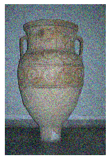

# Image-Denoising

### Background
Image noise is random variation of brightness or color information in images. There can be multiple sources of image noise. Noise can get introduced inherently at a different stage of image capture pipeline from light variation, camera optics, image sensor to image storage.

### The Problem
One of the fundamental challenges in the field of Image processing and Computer vision is Image denoising, where the goal is to estimate the original image by suppressing noise from the contaminated region in an Image. Image Denoising has numerous applications, such as:
* digitization and restoration of old photos/documents.
* satellite imagery, etc

Also Image denoising is useful as a preprocessing step for several computer vision tasks where obtaining the original image content is crucial for strong performance:
* visual tracking
* image segementation
* object detection
* image classification

This project aims to extract a clean image  from the noisy image , with noisy component as , which is explained by 

.

### Problem Scope
We are limiting the problem scope to tackle additive guassian white noise(AGWN) only and will demonstrate how supervised and unsupervised techniques could be used to denoise images with AGWN.

### Metrics

#### PSNR(Peak Signal-to-Noise Ratio)
PSNR is most easily defined via the mean squared error (MSE). Given a noise-free m×n monochrome image I and its noisy approximation K, MSE is defined as:

#### SSIM

The difference with respect to other techniques mentioned previously such as MSE or PSNR is that these approaches estimate absolute errors; on the other hand, SSIM is a perception-based model that considers image degradation as perceived change in structural information, while also incorporating important perceptual phenomena, including both luminance masking and contrast masking terms. Structural information is the idea that the pixels have strong inter-dependencies, especially when they are spatially close. These dependencies carry essential information about the structure of the objects in the visual scene. Luminance masking is a phenomenon whereby image distortions (in this context) tend to be less visible in bright regions, while contrast masking is a phenomenon whereby distortions become less visible where there is a significant activity or "texture" in the image.

### Data

As we have multiple approaches and experiments, we have chosen a common dataset CBSD68 [3] to analyze results. The CBSD68 dataset is a dataset commonly used for benchmarking in Image denoising domain. It contains 68 images and corresponding noisy images at different sigma levels.  

Note that as this dataset has quite less no. of samples, for supervised learning approach we have also used other datasets for training. We have explored other datasets for unsupervised approach as well as mentioned below.

#### Supervised:
* PASCAL dataset [2]
* <to be added by Ramesh>
 
#### Unsupervised:
* Digits dataset from scikit learn.
* RGB images from CBSD68 dataset for PCA decomposition.

## Supervised:

In this approach, we have used supervised learning to learn the clean image given a noisy image. The function approximator chosen is a neural network comprising of convolutional and residual blocks, as shown in figure below. Two experiments were conducted, one with pure convolutional layers and the other with mix of convolutional and residual block as detailed below.

### Experiment 1: DnResNet

The code is available [here](https://colab.research.google.com/drive/1ViNx_b5FlwXjzjIqRuYkdNsgF6ZExqRk) and [here](https://colab.research.google.com/drive/1-LJ12r-DJXY3HI0hzVIom2r9RpCdL8Gd).

##### Datasets

Two datasets were used in this experiment PASCAL VOC 2010 [2] and CBSD68. The PASCAl training data contains approximately 10k images. This dataset is split into training, valid and test datasets with ratios 80, 10 and 10 respectively. The CBSD68 is used for testing purpose only, in this experiment.

##### Architecture

As shown in the figure below, the architecture takes an Input image, and then it is passed through convolutional layers having 64 filters of 9x9 kernel size, 32 filters of 5x5 kernel size, and 1 filter of 5x5 filter size respectively. Relu activations are used in all the layers. Stride used is of size 1, so the output size is reduced by 8 pixels in all directions. To accommodate this, we can either pad the image or give a larger input size. we chose to go with the latter as chosen in [1]. 

   
 
 
 Figure 1. Network architectures used in (left) Experiment 1 and (right) Experiment 2. The graph is generated using the Netron app [5] 

 
 
##### Data Augmentation/Pre-processing

The input image size used is of size 33x33 and output size is 17x17. As input images have varied dimensions in PASCAL dataset(or other datasets), during preprocessing, we have cropped the images. Note that crop can be at random part of the image. So, this acts as data augmentation technique as well. The 33x33 input image should have noise as well. The added noise is random from 10-50 sigmas. The corresponding clean mid-portion of this image is target.

##### Training: 

Pytorch [4] is used to write the code, and network is trained in google colab using GPU's. Training is done batchwise using 128 batches of 33x33 noisy input images and 17x17 corresponding clean target images. MSE loss and Adam optimzer were used with learning rate of 0.001. Using the clean target image of 17x17, the MSE loss is calculated from the networks output image. Training is done for 100 epochs at this configuration. As loss got stagnated here we reduced learning rate to 0.0001 and trained another 50 epochs. After this, we added a residual block to the network and initialized its weights to random weights, with other layers weights unchanged. This network is trained for another 50 epochs with learning rate 0.01. We have stopped training at this point due to longer training periods (50 epochs approximately took 2 hours), even though it been shown in [1], that adding more residual blocks will improve the PSNR scores further. At all stages of training, validation loss is calculated and monitored as well to see if the network is generalizing to unseen data.

Note, to experiment further with residual blocks, experiment 2 is performed, which will be detailed below.

##### Traning and validation loss graph:

  
 
##### Results and observations:

The average PSNR scores and SSIM scores on the test set of PASCAL, for the best model was given below. Note that best model is 3 layered, as 5 layered one couldn't be trained completely due to computing constraints. Input crop size of 200 was used to show the results instead of 33. Also, left value in the column indicates average PSNR compared with noisy input, while the right bolded one indicates the average PSNR with the denoised output. Similar case with SSIM.

**Sigma** | **PSNR **| **SSIM**
---|---|---
10 | 28.33->**31.92** | 0.73->**0.90** 
25| 20.63->**28.94**| 0.44->**0.83**
50| 15.13->**25.66** | 0.24->**0.70**
50(crop 33)|15.16->**26.77**|0.22->**0.69**

The same model is tested on the CBSD dataset, Average PSNR and SSIM score are as follows, 

**Sigma** | **PSNR **| **SSIM**
---|---|---
10 | 28.26->**33.33** | 0.75->**0.93** 
25| 20.48->**29.45**| 0.45->**0.85**
50| 14.97->**25.67** | 0.25->**0.71**
50(crop 33)|15.04->**26.68**|0.23->**0.69**

The above results indicate the **model is generalising well** to other datasets having similar noise as AWGN. Also, the net PSNR achieved is a bit a lower than from the paper's [1] best, as we are only using 3 layers for training.

## Approach 3

In this experiment we implement the residual network connections in the convolutional denoising network. Since residual networks are memory intensive, we train the network on a different dataset [DIV2K] which is smaller and test the network on our validation set :[CBSD]. The DIV2K dataset consists of 800 very high resolution images.

## Residual networks

It is known that very deep neural networks have very high representational power, but comes very difficult to train compared to shallow networks. This can be attributed the vanishing gradients during backpropagation i.e very little information / learning is happening in the first few layers of the network. This is fixed by creating residual connections between layers. These residual connections allow gradients to flow directly to the earlier layers thus enabling more efficient learning. Essentially the network formed by these residual connections is comparable to a shallow network present within the deeper network. Thus we retain the generalizing power of shallow network.

## Dataset

We use a pytorch dataloader for setting up the data pipeline, we extract random 128x128 crops of the images as the input image.
We randomly flip it horizontally and vertically as our data augmentation steps. 
Then we add gaussian noise to the this image and consider that as our noisy image.
We return this pair of original and noisy image as the training input to our network.
We set the batch size to 8 as it is the maximum allowable size by the constraints of our GPU.

### Architecture

We use 8 convolutional layers with a skip connection between every convolutional layer and the output of the layer following it. These skip connections allow us to train a much deeper network. The network learns to output the noise component of the image i.e it learns to separate the noise from the ground truth image. So to obtain the denoised image, we subtract the output of our model from the noisy image.

### Implementation and Hyperparameters

Each convolutional layer consists of 64 filters, kernel size of 3, stride of 1 and padding of 1. This combination allows the layer to preserve the size of the input image after the forward pass, allowing us to arbitrarily stack these layers (as needed for resnet architectures). We use RELU activation function after each convolutional layer.
We also disable the bias components of the layers, this reduced the amount of artifacts present in the output image after denoising.
For optimization we use the ADAM optimizer with learning rate of 0.001 and train the network for 5 epochs. 
In order to improve convergence, we also use learning rate scheduler to reduce learning rate by factor of 10 if there is no improvement for 3 epochs.

### Results and Observations

  
   
  

During evaluation, we apply the network on the whole image as the convolutional operations can be applied on any image size.

We obtain the results as documented in the tables below. We obtain reasonable improvements to PSNR (25.6) and SSIM scores. We get PSNR results comparable to our other models. We notice that the training / validation loss are very close which implies that there is possiblility of more improvement which can be explored with more compute resources.

Another novelty that we applied is passing the denoised image back into the model for further refinement, we observe that the PSNR values get a slight reduction but the SSIM score improves by about 0.1 (especially with larger noise ranges). This approach is similar to our PCA approach with iterative application.

## Unsupervised

### Experiment 3: Vanilla PCA

Principal component analysis is an orthogonal transformation that seeks the direction of maximum variance in the data and commonly used in dimensionality reduction of the data. Data with maximum variance contains most of the data needed to present the whole dataset. In image denoising, one has to take care of the compromise between noisy data and preserving the high variance image data detail. We can start by looking into the PCA analysis to see how PCA inherently tries to reduce the noise in an image.

The basic intuition behind denoising the image is that any components with variance much larger than the effect of the noise should be relatively unaffected by the noise. So if you reconstruct the data using just the most significant subset of principal components, you should be preferentially keeping the signal and throwing out the noise. Though this is not an efficient approach(we will look at better approach through modified PCA in the next section), we can examine how a plain vanilla PCA can improve the PSNR(peak signal to noise ration) over an image.

We tried the plain vanilla PCA method in the mnist digit data set, and then in the RGB images. The approach is:
* Take the Digits dataset
* Add some random Gaussian noise to the image
* Plot the variance vs Component curve to determine the component storing the highest variation.
* Apply inverse PCA to get the image back using the components derived in the above step.
* Visualize the dataset again to see the difference.

Before PCA transformation the digit dataset looks like this:

After this we add some random Gaussian noise to it, to make pixels more blurr and add some noise to it.
After adding random gaussian noise, the digit dataset looks like this:

Now we try to see the number of components which can capture most of the variance in the data. From the below
figure, we can see that first 10 components can capture 80 percent of the variance in the data.

Next, we try to plot the digit data for our noisy image using the first 10 components, and we can see that 
it PCA preserves the signals and loses the noise from the data:

Let's run the same experiment in a RGB image to see if there is an improvement in PSNR after PCA analysis.
The method remains the same:
* Take a Noisy RGB image
* Flattens the Image across 3 channels.
* Do PCA analysis to get the max number of components restoring maximum variance.
* Do inverse PCA transform to retrieve the same image using the component derived in the above step.
* Calculate the PSNR value for original, noisy image and original, denoised image and see if there is an improvement.

We ran the above process for the CBSD68-dataset provided by Berkeley. It contains both noisy and original image with different gaussian noise level.In the below figures there is comparison which is been made to see how the psnr value and how smim values improves after doing PCA decomposition in a noisy image, but the **limitation** of vanilla PCA is that it is not necessary that it will reduce the noise always, but it always captures the data with higher variance. To make the point consider the result on a original and noisy and its denoised part below:

| | | |
|:--:| :--:| :--:|
| **Original Image** | **Noisy Image-50**| **Denoised Image-50**|
| | | |

You can observe from above that the results are not that good but there is an improvement in the psnr and smim values, because the denoised part tries to capture the pixels with higher variance. That is why most part of the image in denoised is a bit brown as that is the prominent color in our original image as well.

| | |
|:--:| :--:|
| **Gaussian Noise level-50** | **Gaussian Noise level-25**|
|  | |
| *PSNR comparison accross images* | *PSNR comparison accross images* 
|  | |
| *SMIM comparison accross images*  | *SMIM comparison accross images* |

To rerun the experiment, please clone this repository and run PCA.ipynb notebook under notebooks directory.

<!--
**Gaussian Noise level-5**

**Gaussian Noise level-15**
 
**Gaussian Noise level-25**
 
**Gaussian Noise level-35**
 
-->

##### locally adaptive PCA

## Results comparison across approaches:
<other approach values to be addded here>

Average PSNR on CBSD68 dataset for all experiments:

**Sigma** | **Experiment 1**| **Experiment 2**| **Experiment 3(Vanilla PCA)**|**Experiment 4**
---|---|---|---|---
10 | 28.26->**33.33**| |28.26->**26.46**  | |
25| 20.48->**29.45** | |20.48->**22.93** | |
50| 14.97->**25.67** | |14.97->**18.60** | |

Average SSIM on CBSD68 dataset for all experiments:

**Sigma** | **Experiment 1**| **Experiment 2**| **Experiment 3(Vanilla PCA)**|**Experiment 4**
---|---|---|---|---
10 | 0.75->**0.93** | |0.75->**0.9** | |
25| 0.45->**0.85**. | |0.45->**0.72** | |
50|  0.25->**0.71** | |0.25->**0.46** | |

## Qualitative Results (from all approaches/experiments):

| **Original** | **Nosiy Input with sigma=50** |
|:--:| :--:|
| |  |
| *NA* | *PSNR=14.91, SSIM=0.31*|
| **Experiment 1 denoised output** | **Ramesh output** |
|| |
| *PSNR = 24.25, SSIM = 0.73*  | *PSNR=??, SSIM=??* |
| **Vanilla PCA Denoised output** | **Varun output** |
||  |
| *PSNR=19.15, SSIM=0.58* | *PSNR=??, SSIM=??* |

| **Original** | **Nosiy Input with sigma=25** |
|:--:| :--:|
| |  |
| *NA* | *PSNR=20.19, SSIM=0.21*|
| **Experiment 1 denoised output** | **Ramesh output** |
|| |
| *PSNR = 32.78, SSIM = 0.84*  | *PSNR=??, SSIM=??* |
| **Vanilla PCA Denoised output** | **Varun output** |
||  |
| *PSNR=19.15, SSIM=0.58* | *PSNR=??, SSIM=??* |

| **Original** | **Nosiy Input with sigma=10** |
|:--:| :--:|
| |  |
| *NA* | *PSNR=28.12, SSIM=0.61*|
| **DN Resnet Denoised output** | **Ramesh output** |
|| |
| *PSNR = 35.41, SSIM = 0.94*  | *PSNR=??, SSIM=??* |
| **Vanilla PCA Denoised output** | **Varun output** |
||  |
| *PSNR=19.15, SSIM=0.58* | *PSNR=??, SSIM=??* |

## References:

1. Ren, H., El-Khamy, M., & Lee, J. (2019). DN-ResNet: Efficient Deep Residual Network for Image Denoising. Computer Vision – ACCV 2018 Lecture Notes in Computer Science, 215–230. doi: 10.1007/978-3-030-20873-8_14
2. pascal-voc-2010. (n.d.). The {PASCAL} {V}Isual {O}Bject {C}Lasses {C}Hallenge 2010 {(VOC2010)} {R}Esults. Retrieved from http://www.pascal-network.org/challenges/VOC/voc2010/workshop/index.html
3. Clausmichele. (n.d.). clausmichele/CBSD68-dataset. Retrieved from https://github.com/clausmichele/CBSD68-dataset.
4.  pytorch/pytorch. Retrieved from https://github.com/pytorch/pytorch.
5.  lutzroeder/netron. Retrieved from https://github.com/lutzroeder/netron
6.  Vanderplas, Jacob T. Python Data Science Handbook: Tools and Techniques for Developers. OReilly, 2016.

